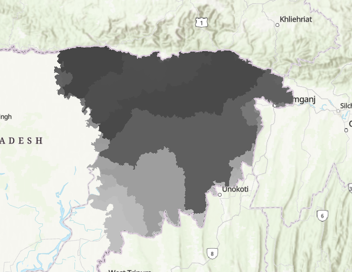
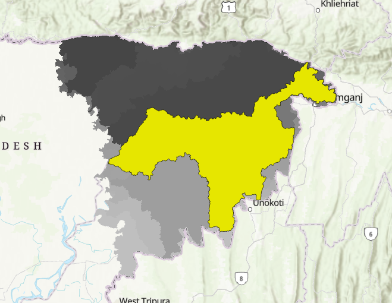
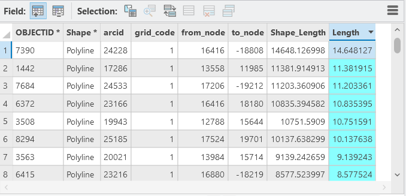
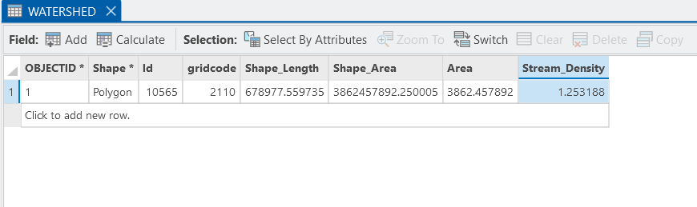
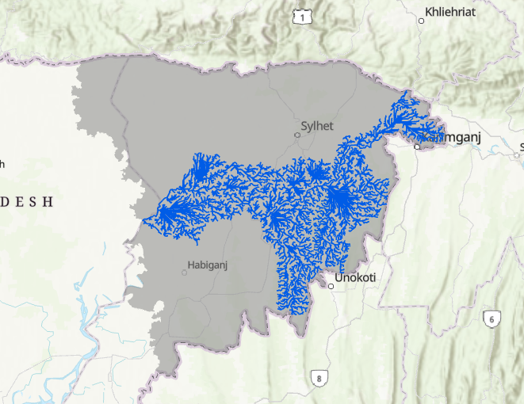

# Sylhet-Watershed-Analysis
ArcGIS Pro project mapping out the stream networks and watershed boundaries of the Sylhet Basin. Used USGS DEM data to calculate flow pathways and drainage density, helping pinpoint exactly which areas face the highest risk of flash floods.
```
# Flood Risk Mapping — Sylhet Basin

This project maps stream networks and watershed boundaries across the Sylhet Basin using ArcGIS Pro. By processing elevation data and analyzing drainage density, it identifies which areas face the highest flash flood risk — particularly from transboundary inflows along the northern border.

---

## Workflow

### 1. DEM Processing & Basin Extraction

Downloaded 30m DEM tiles from [USGS EarthExplorer](https://earthexplorer.usgs.gov/), merged them into a single layer, then ran the **Fill** tool to remove artificial sinks.

From there, **Flow Direction** and **Flow Accumulation** grids were generated to model how water moves across the terrain. The **Basin** tool then extracted all regional catchments, converted to vector polygons.



The largest continuous catchment was isolated to define the primary Sylhet Basin study area.



---

### 2. Stream Network Extraction

To separate permanent river channels from minor surface runoff, the flow accumulation raster was filtered in **Raster Calculator** using a 600-pixel threshold:

```
"Flow_Accumulation" > 600
```

This keeps only channels with a meaningful upstream drainage area — cutting out noise while preserving the core network. Outputs were converted to vector lines using **Raster to Polyline**.

.jpg)

---

### 3. Geometric Calculations

Stream lengths and basin area were calculated from the attribute tables using **Calculate Field**, then used to derive drainage density.







---

## Results

$$D_d = \frac{4849.20 \text{ km}}{3862.46 \text{ km}^2} = 1.25 \text{ km/km}^2$$

| Parameter | Value |
|---|---|
| Total Stream Length | 4,849.20 km |
| Basin Area | 3,862.46 km² |
| Drainage Density | 1.25 km/km² |

---

## What the Drainage Density Shows

The **Line Density** tool split the watershed into 5 zones.

.png)

- **Low density zones (0.15–0.8 km/km²)** cover 53.4% of the basin — flat haor wetlands that absorb and hold large volumes of monsoon rain naturally.
- **High density zones (2.21–3.55 km/km²)** run along the steep northern border — these are where transboundary rains funnel down fast, driving the flash floods that hit the Surma River system downstream.

---

## Tools Used

ArcGIS Pro · USGS EarthExplorer · Flow Direction · Flow Accumulation · Raster Calculator · Line Density · Raster to Polyline
```
